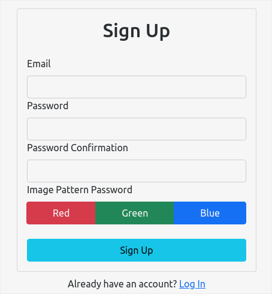
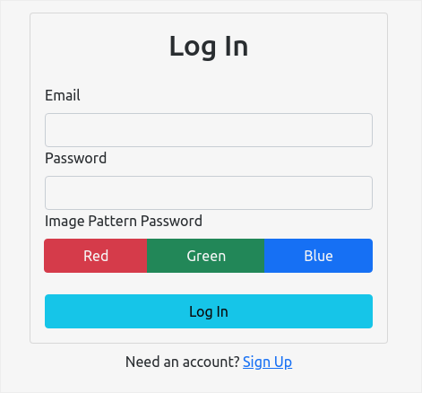

# Graphical Password Authentication

> This project implements a simplified Graphical Password Authentication for the Smart India Hackathon (SIH) 2022.

---

## Description

Graphical Password Authentication uses Images / Colors clicked in a specific pattern as a password. In this project, both
the conventional text password is used along with the graphical password for extra security. The project is made using
Modern Technologies including [React](https://reactjs.org/), [TypeScript](https://www.typescriptlang.org/),
[React-Bootstrap](https://react-bootstrap.github.io/), [React-Router](https://reactrouterdotcom.fly.dev/) and [Firebase](https://firebase.google.com/).

The user is required to signup with an email, text-password and a simple Graphical
password pattern which consists of pressing three colors (Red, Green and Blue) in some particular order to ensure maximum
security. The front-end is built using [React](https://reactjs.org/) and [TypeScript](https://www.typescriptlang.org/) and
a Serverless back-end Authentication service using [Firebase](https://firebase.google.com/). This project can be extended
for complicated graphical passwords using the same methodology.

---

## Images

---

## License

GNU GENERAL PUBLIC LICENSE
Version 3, 29 June 2007

Copyright (C) 2007 Free Software Foundation, Inc. <https://fsf.org/>
Everyone is permitted to copy and distribute verbatim copies
of this license document, but changing it is not allowed.
